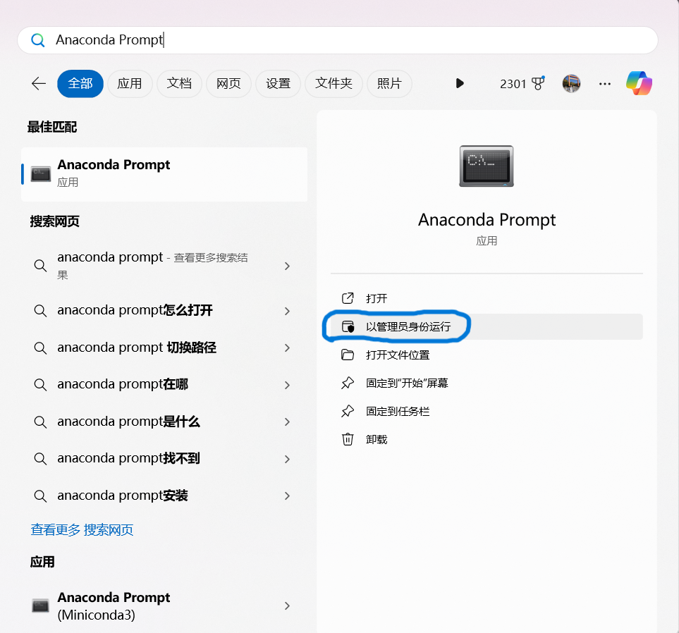
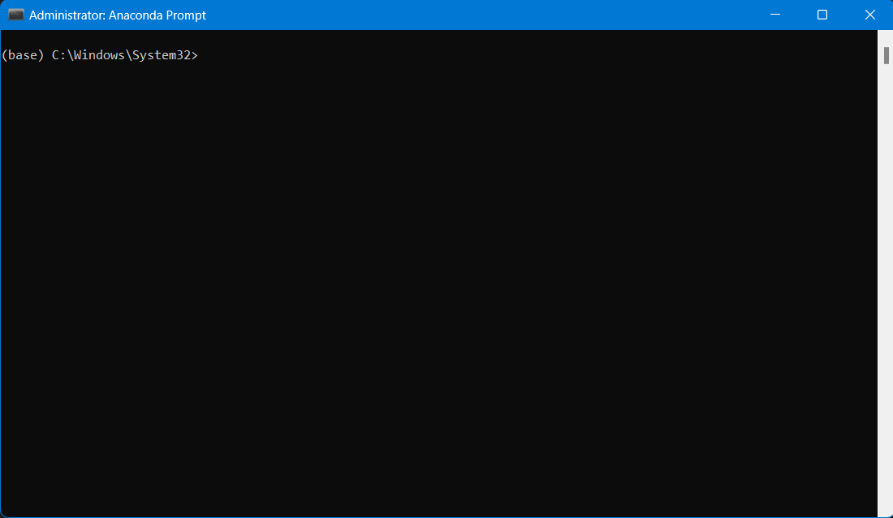
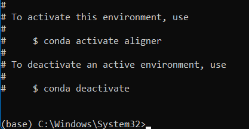
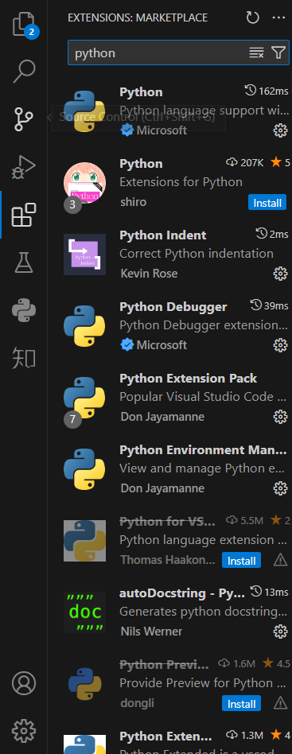
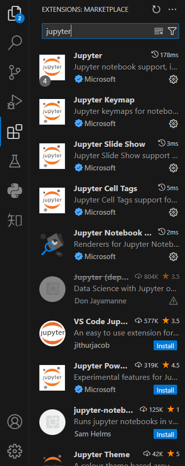
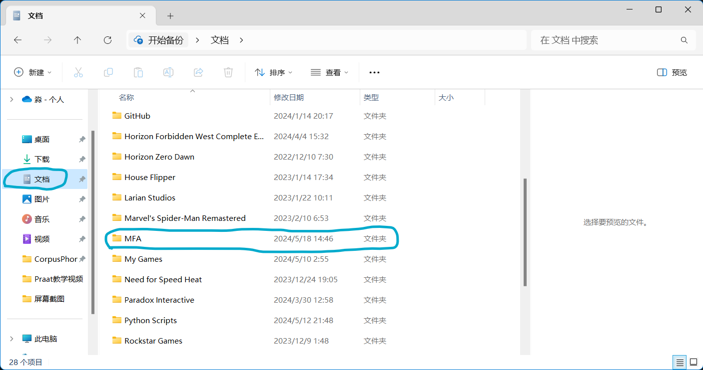
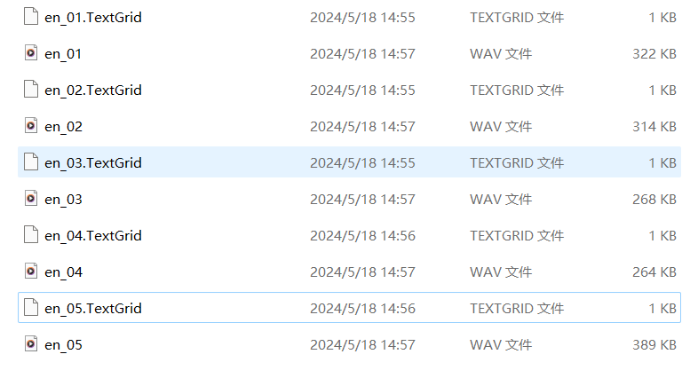
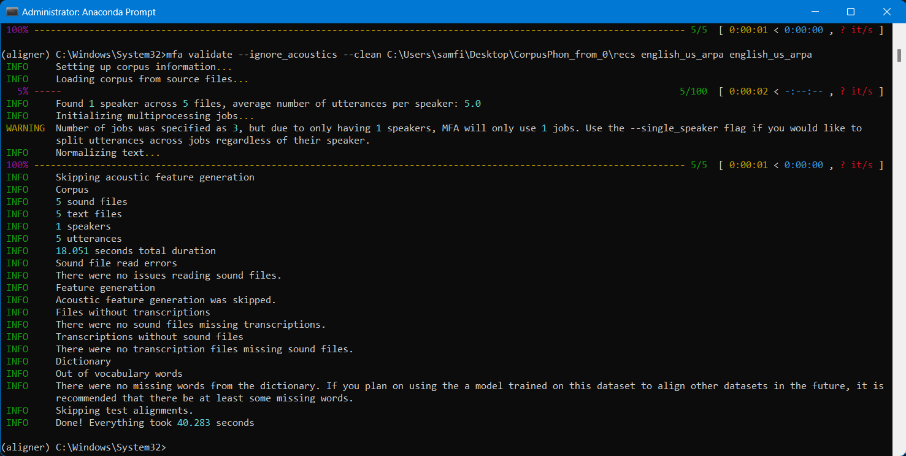
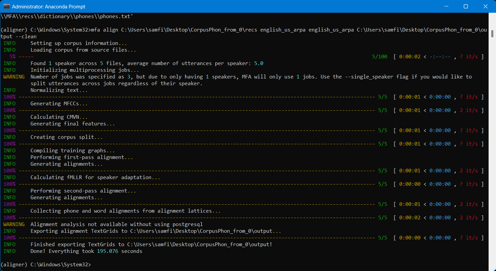

#! https://zhuanlan.zhihu.com/p/698534635
# 语音语料库研究方法入门01: Montreal Forced Aligner（蒙特利尔强制对齐工具）

友情提示：鉴于绝大多数人应该使用的还是Windows平台的电脑，所以以下讲解全部基于Windows操作系统。苹果用户的操作和以下步骤其实也只有略微不同，为了方便起见我就不赘述了。

## MFA简介

MFA是一个语音强制对齐工具，其构架基于Kaldi自动语音识别工具包。MFA主要的用处一言以蔽之就是提供单词和音层面的自动边界标记。比如说如果我现在有若干在句子层面标记好了内容的录音，并且提供一个单词层面的CMU发音词典，告诉MFA每一个词包含哪些音，那么MFA就能够训练搭建声学模型，并且还能够将声学模型和字母到音素的模型训练到任何你的新数据上。其整个算法和技术框架都是基于Kaldi的。虽然说在当前人工智能研究大潮中，Kaldi这样的工具看起来像是来自上个世代，但不得不说如果要提供单个音层面对齐的话，Kaldi还是非常好用的。并且由于Kaldi配备了一整套的训练和说话人自适应算法，也即根据不同话者的语音产出模式的不同而调整对齐结果，所以对语音学研究来说是非常好用的辅助工具。Kaldi的基本声学模型使用了较为传统的 GMM-HMM （高斯混合模型+隐马尔科夫模型）框架，从单音模型开始寻找语音信号和语音之间的对应，然后搭建三音模型（允许检索包括目标音前后两个音在内的三连音），并在此过程中进行一些转换和说话人自适应。其训练过程可以简单表述如下：

1. 第一阶段：Monophone 单音模型
在这个阶段，MFA 会用单音模型来进行第一次对齐。简单来说，就是每个音素都会被当成独立的个体来处理，不考虑它们旁边的音素。

2. 第二阶段：Triphone 三音模型
在单音模型建立完毕后，MFA 会用三音模型进行第二次对齐。现在，它不仅关注音素本身，还会注意到音素两旁的“邻居”音素。

3. 第三阶段：LDA + MLLT 线性判别分析降维 + 最大似然线性变换
在这一阶段，MFA 进行 LDA+MLLT 变换，这是为了让每个音素的特征尽可能不同，让他们互相之间区别度达到最大。

4. 第四阶段：SAT 说话人自适应训练
最后一个阶段，MFA 会将说话人的差异考虑在内，提升三音模型的表现。它会计算每个说话人的梅尔频率倒谱系数（MFCC）特征的转换。

作为一个强制对齐系统，蒙特利尔强制对齐器会在电话和单词级别将转录文本与相应的音频文件进行时间对齐，前提是存在一组预训练的声学模型和包含转录文本中单词的标准音标发音（即词典）的发音字典。在实际操作中，简单而言，使用MFA进行强制对齐的步骤如下：

1. 创建一个包含音频文件和转录文本的输入文件夹（该文件夹中每个语音文件都有一个相对应的转录文本文件）
2. 准备一个发音字典
3. 运行`mfa train`训练一个声学模型
4. 运行`mfa align`命令用训练的模型进行对齐

那我们就先从软件的安装开始吧。

## 软件安装

### 安装Anaconda

MFA的安装需要经由[Conda Forge](https://conda-forge.org/)，所以我们首先需要安装Miniconda或者Anaconda。Miniconda和Anaconda的区别可以理解为miniconda是anaconda的瘦身简装版，其预装的python包比anaconda要少得多。但是我个人建议一步到位安装Anaconda，因为如果涉及到做语料库语言学的话有很多数据处理工具都需要在python环境下使用。对于配置Python编程环境没有多少经验的人来说，安装Anaconda可以几乎一步到位配置好日常所需要的很多数据处理工具。不然后来要到处安装各种包。对于使用Python熟练的人来说这些完全是不成问题的。但是如果您是语言学专业研究生的话，那么我估计是没有太多Python使用经验的，还是让安装程序能帮你包办多少就包办多少比较好。后面再在使用过程中慢慢学习就好了。

那么我们首先从这个[网址](https://www.anaconda.com/download/)下载Anaconda。安装文件下载到电脑上以后跟随提示完成安装就可以了。安装完毕以后会自动打开Anaconda浏览器（注意，这个程序不是Anaconda本身）。友情提示：如果使用conda的话不用另行再自己去安装Python了。Conda下载安装完成以后已经帮你把base使用环境里的Python安装好了。另行下载一个Python版本反倒会导致你电脑上的Python版本打架，对于不熟练的初学者来说管理这些环境也是个比较让人头疼的事儿。所以我们能简则简。

### 创建本地环境并且安装MFA

Anaconda安装以后在开始菜单搜索栏中搜索Anaconda Prompt，应该可以看到以下结果：

点选以管理员身份运行。这里为了以后打开Anaconda Prompt方便建议打开后右键点击任务栏上的图标然后选择“固定到任务栏”。打开以后应该可以看到这个窗口：

在窗口中可以看到排头有一个(base)提示。这表明当前命令行在Anaconda的base环境中。然后我们输入这个命令：`conda create -n aligner -c conda-forge montreal-forced-aligner`创建一个名为aligner的虚拟环境并且经由`conda-forge`安装MFA即MFA所需的各种软件，包括Kaldi、scikit-learn和numpy等等。安装中途会让你确认是否继续(Proceed \[y/n\]?)，这时按一下`y`并且回车就可以开始安装了。

安装完毕以后会出现以下提示：

如果要进入这个为MFA创建的虚拟环境可以按照提示输入`conda activate aligner`然后回车确认就可以了。

### 安装VS CODE

现在虽然MFA的虚拟环境配置好了，但是我们搭建语料库的其他工具不可能都在这个环境中运行，而且也不可能什么代码都随时在命令窗口中现敲现用，所以我们还需要一款编辑器。这里推荐使用微软推出的跨平台跨语言的代码编辑器：[Visual Studio Code](https://code.visualstudio.com/)。进入网站下载安装程序到你的电脑上就可以用了。

安装完后去到VS CODE的插件(extension)页面把和Python和Jupyter notebook有关的“官方”插件都安装上就可以了。

### MFA简单功能展示

现在让我们回到刚才MFA的命令行窗口中激活并进入MFA的虚拟环境。激活以后可以看到排头的(base)变成了(aligner)。MFA自带了一些预先训练好了的声学模型和发音词典，我们可以用英语的作为示例看看MFA怎么使用。

在命令窗口中输入`mfa model download acoustic english_us_arpa`可以下载英语模型，然后输入`mfa model download dictionary english_us_arpa`下载英语的发音词典。

下载完成以后从Windows的文件管理器中找到文档下面的MFA文件夹：

然后进入`pretrained_models`文件夹。在这个文件夹的`acoustic`子文件夹中可以看到刚才下载的英语声学模型`english_us_arpa.zip`，然后在`dictionary`子文件夹中可以看到发音此单`english_us_arpa.dict`。前者是一个压缩成.zip格式的文件，后者是一个CMU发音词典的文件格式。注意发音词典不一定需要存储为.dict格式，.txt也是可以的。

如果我们有现成的标好了说话内容（句子层面）的录音数据的化就可以使用这个模型和发音词典做自动标注了。

在标注之前先validate一下语料。在命令窗口里输入：`mfa validate --ignore_acoustics --clean C:\Users\samfi\Desktop\CorpusPhon_from_0\recs english_us_arpa english_us_arpa`。

（注意，该命令--clean后面那一串字符是你的语料库文件夹所在位置。这里用来示例的是我的电脑上的地址，在你运行的时候应该替换为你电脑上的地址。用右键点击该文件夹可以看到一个复制文件地址的选项。点击然后复制到命令行里就可以了。）

该命令运行顺利的话会提示：

然后我们运行`mfa align --clean C:\Users\samfi\Desktop\CorpusPhon_from_0\recs english_us_arpa english_us_arpa C:\Users\samfi\Desktop\CorpusPhon_from_0\output`进行强制对齐。注意千万不要忘记加那个--clean选项，不然的话可能导致MFA无法运行。如果运行顺利的话可以看到如下画面：

然后我们看到在同一个文件夹中生成了一个新文件夹output，打开output里面的TextGrid文件和recs文件夹里的同名录音文件可以检查强制对齐的结果。可以看到MFA自带的这个英语模型是非常好用的。即使这是我用电脑自带的麦克风录的我自己的非母语英语片段，依然精确地找到了各个音的边界和标签。

本教程的所有教学材料都可以在我的[GitHub](https://github.com/ZenMule/CorpusPhon_from_0)上找到。