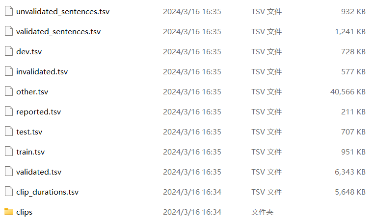
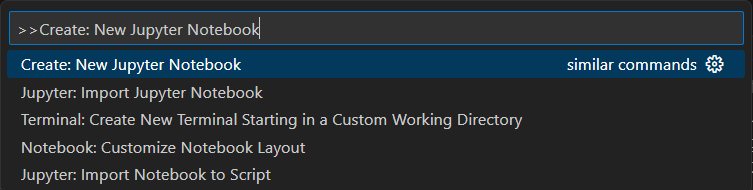
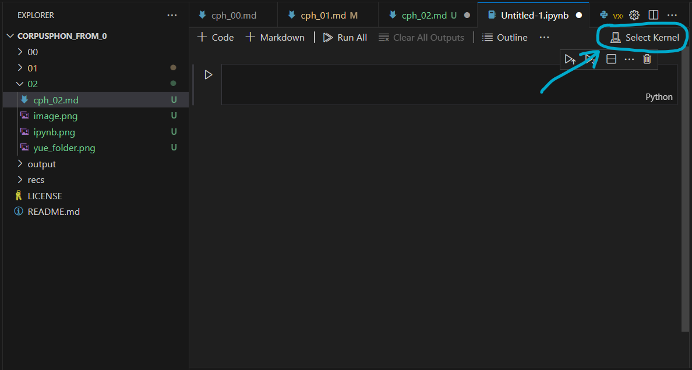

#! https://zhuanlan.zhihu.com/p/699869621
# 语音语料库研究方法入门02: 建立自己的语料库(1) - 生成发音词典

这一讲我们要进行为了跑MFA模型而进行的语料库数据的预处理。这里我们以Common Voice语料库上的粤语数据为例讲解如何把只有录音的语料库构建为方便MFA进行建模的结构。为此我们首先要搭建一个所有录音文件都有对应的标注信息(textgrid格式)的语料库，然后要生成一个发音词典，把每个单词的读音以国际音标的形式标注出来（此一步不一定必须要用国际音标，X-SAMPA或者ARPABET或其他体系的符号都可以）。

## Common Voice语料库

[Common Voice语料库](https://commonvoice.mozilla.org/zh-CN)是Mozilla organization公开的语音数据集。其采取由世界各地志愿者贡献的声音的形式提供数据。Common Voice的初衷是为了给缺乏语言资源的非主流语言提供数据以训练自动语音识别模型。目前Common Voice上面有一百余个语言，上万个小时的录音。每个语言的录音从不到一小时到超过3800小时不等。这些数据不仅仅在工程应用上，在语音学上也相当有分析价值。我们这一讲将会使用Common Voice中的粤语语料库进行讲解。下载数据的话可以前往[数据下载](https://commonvoice.mozilla.org/zh-CN/datasets)页面。注意下载数据需要注册Common Voice账号。但因为其本身是一个开源项目，所以账号注册也是免费的，先注册一个账号然后将粤语数据集下载到电脑内就好。数据集下载到电脑上解压完成以后应该如以下所示：



这其中我们要用到的是以下这几个文件：

1. `validated.tsv`
2. `clip_durations.tsv`
3. `clips`

Common Voice上的数据由于是由广大网友贡献的。所以有一些数据质量不是很高。于是Common Voice团队将数据集按照审核投票的数量将数据集里的数据分为两类：审核确认票两票以下（0票或1票）的为无效数据(invalidated)，两票或以上的为有效数据(validated)。他们分别存在`invalidated.tsv`和`validated.tsv`两个报表内。我们只需要利用validated报表找到这些有效数据即可。下面来讲讲具体思路和操作方法

## 数据预处理思路

简单介绍一下我们即将要执行的数据预处理步骤

1. 利用`validated.tsv`中的`client_id`信息对发话人进行重新编码
2. 利用`validated.tsv`将有效数据从`clips`文件夹中找出来存入另一个文件夹
3. 在创建textgrid文件之前对`validated.tsv`文件中的标注信息进行分词
4. 利用`validated.tsv`中的标注信息和`clip_durations.tsv`中的每个录音的时长信息创建textgrid文件
5. 利用分词信息创建词库

第一步对发话人进行重新编码是因为我们的textgrid的标记层的层名必须用说话人的编号进行命名。因为MFA的说话人自适应训练对不同说话人的识别是基于标记层的名字进行的。即使所有录音都只有一个textgrid标记层，如果说话人不一样则标记层名就必须不同，不然会导致不同的话者被MFA识别为同一说话人进而导致说话人自适应训练失去了意义。第二步我们将有效数据提取出来把无效数据剔除出数据库。第三步创建MFA训练需要的标记信息。第四步为了创建词库我们首先对汉字信息进行分词。最后建立词库。

## 在VS CODE中使用Jupyter Notebook

以下操作都需要在Python环境中进行。我建议在VS CODE中创建一个Jupyter notebook分块进行操作。打开VS CODE以后按下快捷键`ctrl+shift+p`打开命令搜罗栏然后搜索`Create: New Jupyter Notebook`选择第一个选项就可以在VS CODE中打开Jupyter notebook了。如下图所示：



顺利打开以后应如图所示：



此时需要选择以下该notebook运行的Python解释器。点选图中标出来的`Select Kernel`按钮，然后选择base所示的Python环境即可。

## 发话人重新编码

首先我们先在Python里用pandas中的`read_csv`命令将`validated.tsv`读取进来。由于

```python
import pandas as pd
import csv
valid_path = r'C:\Users\samfi\Downloads\yue\validated.tsv' # 地址前要加r（苹果用户不用），不然路径无法识别
valid_df = pd.read_csv(valid_path, sep = '\t', 
                        quoting=csv.QUOTE_NONE, 
                        low_memory = False, 
                          dtype = { # 指定每个栏的数据类型以提升读取速度和精度
                              'client_id': 'str',
                              'path': 'str',
                              'sentence': 'str',
                              'up_votes': 'int16',
                              'down_votes': 'int16',
                              'age': 'str',
                              'gender': 'str',
                              'accentes': 'str',
                              'variant': 'str',
                              'locale': 'str',
                              'segment': 'str'
                          })
print(valid_df.columns)
```

运行完以后会看到显示该文件中所有栏的栏名：

```
Index(['client_id', 'path', 'sentence_id', 'sentence', 'sentence_domain', 'up_votes', 'down_votes', 'age', 'gender', 'accents', 'variant', 'locale', 'segment'], dtype='object')
```

然后我们就利用`client_id`这一栏对说话人进行重新编号。我们按照他们在数据表格中的出现顺序从1开始编号。

```python
valid_df['speaker_id'] = pd.factorize(valid_df['client_id'])[0] + 1 # 创建一个新的栏起名为speaker_id用以存储重新编号以后的说话人编码
print('说话人编号：', valid_df['speaker_id'].unique().min(), '-', valid_df['speaker_id'].unique().max()) # 显示结果
```

运行完毕以后会显示所有独一无二的说话人编号。可以看到粤语数据集里有700个不同的说话人（当然这里只是依据client_id进行的机械性再编码，如果有不同说话人使用同一个账号录音的话这个方法会将他们视为同一个说话人，因为他们的client_id是一样的）。

## 为有效录音创建新路径并且移动文件

我们看到在`validated.tsv`中，第二栏`path`是每个录音的文件名。现在录音全部都在`clips`文件夹里面，所以我们要把这些有效录音从`clips`文件夹中移到另外一个文件夹里。我们把这个新的文件夹取名为`validated`。

```python
import os
root_dir = r"C:\Users\samfi\Downloads\yue" # 替换为你电脑上的文件夹路径
source_folder = os.path.join(root_dir, "clips") # 源文件夹路径（移出位置）
target_folder = os.path.join(root_dir, "validated") # 目标文件夹路径（移入位置）
file_names = valid_df['path'].tolist()
valid_df['source_path'] = [os.path.join(source_folder, file_name) for file_name in file_names] # 源文件位置
valid_df['target_path'] = [os.path.join(target_folder, file_name) for file_name in file_names] # 目标文件位置
os.mkdir(target_folder) # 在电脑上创建目标文件夹
```

运行完毕以后`valid_df`中会出现两个新的栏：`source_path`和`target_path`。前者是录音文件目前所在位置，后者是我们将要把他们移动到的位置。同时在数据集文件夹中出现了一个新创建的名为`validated`的文件夹。这样我们就做好了移动文件的前期准备了。接下来就是移动文件。

```python
import shutil
for src_path, tgt_path in zip(valid_df.source_path, valid_df.target_path):
    shutil.move(src_path, tgt_path) # 把文件从src_path移动到tgt_path
```

上述命令执行完以后会发现有效录音已经全部移动到了`validated`文件夹中。

## 粤语分词

为了利用Common Voice的标注文本做发音词典，我们需要对标注内容进行分词。Python里有现成的pycantonese包可以用于给粤语文本进行分词处理。pycantonese必须先通过在notebook里运行`%pip install pycantonese`安装（或者直接在命令行里运行`pip install pycantonese`）然后才能导入使用。特别注意的是当安装这些包的时候一定不要在`aligner`环境下安装，因为`aligner`环境是为了确保MFA能够稳定运行而不被别的包的版本更新所影响。*如果命令行里行头有一个`(algner)`的文字提示的话记得运行一下`conda deactivate`退出到`base`环境中*。

下面我们开始处理数据进行粤语分词。

```python
import pycantonese # 导入pycantonese包
yue_sentences = valid_df['sentence'].tolist()
print('分词前结果:')
for i in yue_sentences[0:9]:
    print(i)
print('\n分词后结果:')
yue_tok = [' '.join(pycantonese.segment(sentence)) for sentence in yue_sentences]
for i in yue_tok[0:9]:
    print('\t' + i)
```

如果顺利运行的话可以看到如下结果：

```
分词前结果:
	冇事，唔緊要
	驚佢唔搞落去
	嗰個幫我整影片嘅朋友都同我提過佢
	乜鬼嘢記憶力？
	好啦，麻煩晒，再見！
	我知係唔啱時侯去要求你哋原諒我
	拼音靠打詞打句可以降重
	你以為我真係咁膚淺咩？
	嗰個係因為我哋呢邊有規範嘅，請你理解下

分词后结果:
	冇事 ， 唔緊要
	驚 佢 唔 搞落去
	嗰個 幫 我 整 影片 嘅 朋友 都 同 我 提過 佢
	乜鬼嘢 記憶力 ？
	好 啦 ， 麻煩 晒 ， 再見 ！
	我 知 係 唔 啱 時侯 去 要求 你哋 原諒 我
	拼音 靠 打 詞 打 句 可以 降 重
	你 以為 我 真係 咁 膚淺 咩 ？
	嗰個 係 因為 我哋 呢 邊有 規範 嘅 ， 請 你 理解 下
```

然后我们就可以在此基础上取得粤语的单词了。首先我们把各种标点符号和数字以及多余的空格全都替换为单个的半角空格。

```python
import re
punct = r'[。，“”、；：？！—「」『』（）《》〈〉【】〔〕“”‘’……——～]' # 所有可能的中文标点符号
yue_texts = [re.sub(punct, ' ', text) for text in yue_tok] # 将所有标点符号替代为一个半角空格
yue_texts = [re.sub('[\d\s\W]+', ' ', text) for text in yue_texts] # 将所有连续的数字或者空格或其他非文字替换为单个半角空格
for i in yue_texts[0:9]:
    print(i) 
```

这一步执行完毕以后应该看到结果如下所示：

```
冇事 唔緊要
驚 佢 唔 搞落去
嗰個 幫 我 整 影片 嘅 朋友 都 同 我 提過 佢
乜鬼嘢 記憶力 
好 啦 麻煩 晒 再見 
我 知 係 唔 啱 時侯 去 要求 你哋 原諒 我
拼音 靠 打 詞 打 句 可以 降 重
你 以為 我 真係 咁 膚淺 咩 
嗰個 係 因為 我哋 呢 邊有 規範 嘅 請 你 理解 下
```

接下来我们从这些文本中把每一个独特的词都取出来。

```python
yue_words = ' '.join(yue_texts) # 将所有句子都合并为一个字符串
yue_words = re.sub('\s+', ' ', yue_words) # 把连续的多个空格替换为一个
yue_words = yue_words.split(' ') # 将每个词按照空格分开
yue_words = list(sorted(set(yue_words))) # 将每个独一无二的词取出来

# 将含有拉丁字母的词剔除出单词列表
latins = re.compile('[A-Za-z]') 
yue_words = [word for word in yue_words if not latins.search(word)]
for item in yue_words[0:9]:
    print(item)
```

如果顺利运行以上步骤应该可以看到：

```
〇
㓤
㓤親
㖭
㗇
㗇人
㗎
㗎仔
㗱
```

我们分两步给这些单词标注上读音：第一步将汉字转换为粤语拼音（jyutping），然后将粤语拼音转换为国际音标符号。首先我们先将汉字转换成粤语拼音。

```python
jyp = []
for word in yue_words:
    jyutping = pycantonese.characters_to_jyutping(word)[0][1]
    jyp.append(jyutping)
for item in jyp[0:9]:
    print(item)
```

这一步运行成功的话可看到以下结果：

```
ling4
gat1
gat1can1
tim1
gaa5
haa1jan4
gaa4
gaa4zai2
zaap6
```

```python
# 安装将粤语拼音转换为国际音标符号所必须的各种工具包
# epitran能将粤语拼音转换为国际音标
# jamo和g2pk是epitran能够顺利运行所需的包
# lingpy是为了将单个国际音标用空格分开
%pip install epitran jamo g2pk lingpy
```

```python
import epitran
epi = epitran.Epitran('yue-Latn')
yue_ipa = []
for item in jyp:
    if item is None:
        phone = ''
    else:
        phone = epi.transliterate(item)
    yue_ipa.append(phone)
for item in yue_ipa[0:9]:
    print(item)
```

可以看到粤语拼音都转换为了国际音标：

```
lɪŋ
kɐtʰ
kɐtʰt͡sʰɐn
tʰiːm
kaː
haːjɐn
kaː
kaːt͡sɐi̯
t͡saːpʰ
```

但是我们可以注意到epitran的转换也不是完美的。比如音节末尾的粤语辅音应该不会有送气特征而应是未除阻的。所以我们把音节末尾的塞音全都另外转换一下把送气符号去掉，全部加上未除阻符号。并且还有其他几个细节也稍微修正一下，并且将每个音都按照CMU发音词典的格式用空格区隔开。

```python
from lingpy import ipa2tokens # 导入能将国际音标用空格区隔开的功能ipa2tokens
yue_trans = []
for item in yue_ipa:
    if item.strip() == '': # 如果该单词没有产生对应的粤语拼音则其国际音标转写也为空
        item = ''
    else:
        item = re.sub(r'(p|pʰ|t|tʰ|k|kʰ)($|p|t|t͡s|s|f|k|m|n|ŋ|l|j|w|h|ʔ)', lambda m: f"{m.group(1).replace('ʰ', '')}̚{m.group(2)}", item) # 将音节末塞音上的送气符号去掉并添加未除阻符号
        item = re.sub(r'j(i|y)', r'\1', item) # 删掉i或y前的j
        item = re.sub('wu', 'u', item) # 删掉u前的w
        item = ' '.join(ipa2tokens(item)) # 把每个音以空格区分开
 
    yue_trans.append(item)
for item in yue_trans[0:9]:
    print(item) # 打印结果
```

运行完毕以后可以看到结果输出为：

```
l ɪ ŋ
k ɐ t̚
k ɐ t̚ t͡sʰ ɐ n
tʰ iː m
k aː
h aː j ɐ n
k aː
k aː t͡s ɐi̯
t͡s aː p̚
```

然后我们可以把单词和其对应的转写拼贴在一起：

```python
yue_dict = []
for word, trans in zip(yue_words, yue_trans):
    if trans.strip() != '': # 只有当国际音标转写不为空的时候才保存到词典
        entry = word + '\t' + trans
        yue_dict.append(entry)
for entry in yue_dict[0:9]:
    print(entry)
```

CMU发音词典形式的输出结果如下：

```
〇	l ɪ ŋ
㓤	k ɐ t̚
㓤親	k ɐ t̚ t͡sʰ ɐ n
㖭	tʰ iː m
㗇	k aː
㗇人	h aː j ɐ n
㗎	k aː
㗎仔	k aː t͡s ɐi̯
㗱	t͡s aː p̚
```

然后我们把这个发音词典存到硬盘上就可以了。

```python
dict_file = r"C:\Users\samfi\Downloads\yue\yue_dict.txt" # 替换为你电脑上的路径
with open(dict_file, 'w') as f:
    for entry in yue_dict:
        f.write(entry + '\n')
print("The dictionary is saved to:", dict_file)
```

```
# 运行结果：
The dictionary is saved to: C:\Users\samfi\Downloads\cv_yue\cv-corpus-17.0-2024-03-15\yue\yue_dict.txt
```

以上我们就完成了运行MFA训练声学模型所需的预处理步骤一，生成一个MFA所需的发音词典。下一讲我们会继续讲解批量生成textgrid并且利用MFA训练模型和自动标注。

本讲的所有材料都可以在[GitHub](https://github.com/ZenMule/CorpusPhon_from_0)上找到。

如果有不懂的欢迎在评论区留下你的问题。