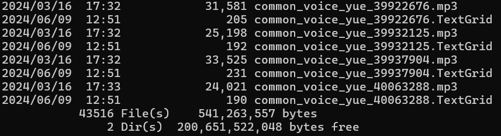
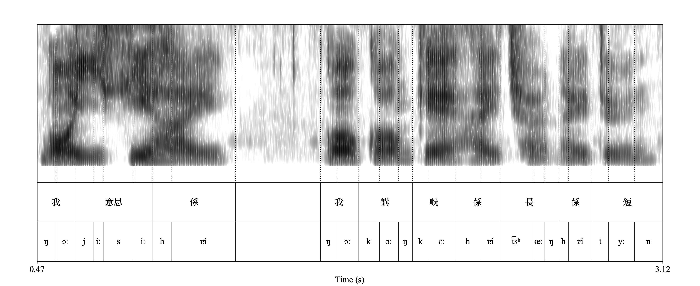

#! https://zhuanlan.zhihu.com/p/702500767
# 语音语料库研究方法入门03: 建立自己的语料库(2) - 批量创建TextGrid并训练模型

上一讲我们已经创建好了一个可以用的发音词典，因此训练模型的前期准备三我们已经完成了两个：

1. [x] 准备录音 
2. [x] 准备发音词典
3. [ ] 准备标注文本

因此这一讲我们着重讲解如何批量准备标注信息。其实，因为Common Voice的数据已经自带了标注信息，即`validated.tsv`文件中的sentence一栏，所以我们只需要利用这一栏的信息直接批量给每个录音文件创造一个TextGrid并且把文本信息放进这些TextGrid就好。为了实现这一步骤，我们需要用到三个工具：

1. `validated.tsv`: 读取文本信息
2. `clip_durations.tsv`: 读取每个录音的总时长信息
3. `praatio`Python工具包: 在Python中创建并保存TextGrid文件

因为Common Voice的粤语文本数据并没有分词，所以同样的我们需要先对粤语文本进行分词处理（具体方法见上期），将分过词的粤语文本加入到报表之中：

```python
import pandas as pd
import csv, os
# 读取数据
valid_path = r'C:\Users\samfi\Downloads\yue\validated.tsv'
valid_df = pd.read_csv(valid_path, sep = '\t', 
                        quoting=csv.QUOTE_NONE, 
                        low_memory = False, 
                          dtype = { #
                              'client_id': 'str',
                              'path': 'str',
                              'sentence_id': 'str',
                              'sentence': 'str',
                              'up_votes': 'int16',
                              'down_votes': 'int16',
                              'age': 'str',
                              'gender': 'str',
                              'accentes': 'str',
                              'variant': 'str',
                              'locale': 'str',
                              'segment': 'str'
                          })

valid_df['speaker_id'] = pd.factorize(valid_df['client_id'])[0] + 1

# 分词
# 加载pycantonese包以使用粤语分词工具
import pycantonese

# 从validated.tsv中提取文字标注信息
yue_sentences = valid_df['sentence'].tolist()

# 使用pycantonese中的segment命令进行分词
yue_tok = [' '.join(pycantonese.segment(sentence)) for sentence in yue_sentences]

# 将分词结果添加回validated数据集
valid_df['sentence_tok'] = pd.Series(yue_tok)

# 显示结果
print(valid_df['sentence_tok'][0:10])
```

此步骤运行成功的话会显示以下结果：

```
0                           冇事 ， 唔緊要
1                          驚 佢 唔 搞落去
2        嗰個 幫 我 整 影片 嘅 朋友 都 同 我 提過 佢
3                          乜鬼嘢 記憶力 ？
4                  好 啦 ， 麻煩 晒 ， 再見 ！
5          我 知 係 唔 啱 時侯 去 要求 你哋 原諒 我
6                拼音 靠 打 詞 打 句 可以 降 重
7                 你 以為 我 真係 咁 膚淺 咩 ？
8    嗰個 係 因為 我哋 呢 邊有 規範 嘅 ， 請 你 理解 下
9                              下 一 位
```

文本信息具备了，现在为了给每个录音建立一个TextGrid文件我们还需要每个录音的时长信息。Common Voice已经提供了这个数据存储在了刚才提到的`clip_durations.txv`这个文件里面我们读取一下信息即可。

```python
# 读取clip_duration.tsv文件
clip_dur_file = r"C:\Users\samfi\Downloads\yue\clip_durations.tsv"
clip_dur = pd.read_csv(clip_dur_file, sep = '\t', dtype = {'clip': 'str', 'duration[ms]': 'float64'})

# 将栏名改为path和dur，以方便与validated.tsv合并
clip_dur.rename(columns = {'clip':'path', 'duration[ms]':'dur'}, inplace=True) 

# 转换成以秒为单位
clip_dur['dur'] = clip_dur['dur']/1000 

# 将其与validated.tsv数据结合在一起
valid_df = pd.merge(valid_df, clip_dur, on='path', how='left')
```

接下来我们需要用到一个叫做praatio的包给录音文件建立TextGrid标注文件。首先安装以下praatio

```python
%pip install praatio
```

安装好以后我们先定义一下给录音创建TextGrid的函数。这个函数需要四个input参数：录音文件，时长数据，话者id和文本标注。

```python
# 从praatio包中加载textgrid对象
from praatio import textgrid
# 创建一个读取四个argumeent
def create_textgrid(snd_file, dur, speaker_id, transcript, output_folder):
    # 确保除了dur是浮点数以外，其他参数都是字符串
    snd_file = str(snd_file)
    dur = float(dur)
    speaker_id = str(speaker_id)
    transcript = str(transcript)
    
    # 创建一个空白的textgrid对象
    tg = textgrid.Textgrid()

    # 创建一个新的分段标记层(Interval tier)
    speaker_tier = textgrid.IntervalTier(speaker_id, # 标记层名为话者id
                                        [(0.05, dur-0.05, transcript)], # 标记段的起始时间，终止时间和文本信息
                                        0, # 整个标记层的起始位置（应与录音相同）
                                        dur) # 整个标记曾的结束位置（应与录音相同）

    # 将该标记层添加到TextGrid对象
    tg.addTier(speaker_tier)
    # 获取音频文件的文件名
    snd_name, _ = os.path.splitext(snd_file)
    # 创建TextGrid的文件路径名
    tg_filename = snd_name + '.TextGrid'
    tg_path = os.path.join(output_folder, tg_filename)
    print(tg_path, transcript)
    # 将这个TextGrid对象存入硬盘
    tg.save(tg_path, format='short_textgrid', includeBlankSpaces=True)
```

然后我们以刚才的`valid_df`为基础获取这些参数并且创建TextGrid文件。

```python
output_folder = r"C:\Users\samfi\Downloads\yue\validated"
for snd_file, dur, speaker_id, transcript in zip(valid_df.path, valid_df.dur, valid_df.speaker_id, valid_df.sentence_tok):
    create_textgrid(snd_file, dur, speaker_id, transcript, output_folder)
```

这一步运行完毕以后在prompt中输入：

```shell
cd C:\Users\samfi\Downloads\yue\validated
dir
```

应该可以看到如下结果，显示一共有43516个文件。每个mp3都有一个对应的TextGrid文件。



于是所有准备工作都已就绪：

1. [x] 准备录音 
2. [x] 准备发音词典
3. [x] 准备标注文本

接下来我们就可以在此基础上训练模型了。先在命令窗口中（不明白如何打开命令窗口的请参考上期和上上期教程）输入：

```shell
conda activate aligner
```

然后输入以下命令验证语料库（记得将下面的文件和文件路径替换为你电脑上的文件和文件路径）。其中第一个路径为录音文件和标注文件所在文件夹，第二个路径为你的发音词典所在位置。

```shell
mfa validate C:\Users\samfi\Downloads\yue\validated C:\Users\samfi\Downloads\yue\yue_dict.txt --ignore_acoustics --clean
```

验证结果提示有15个未识别词汇（oov word），共97个token。对于一个有两万多个录音的语料库来说这么一点未识别词汇并不造成什么影响。接下来就是训练模型了。输入以下命令并运行即可。前面两个路径名和刚才的validate命令里的是一样的：一个语料库文件夹，一个词典文件夹。最后一个新加的路径是模型训练完毕以后将会存入的位置。

```shell
# 最后一个路径名为最终训练好的模型将要被存入的位置
mfa train --clean C:\Users\samfi\Downloads\yue\validated C:\Users\samfi\Downloads\yue\yue_dict.txt C:\Users\samfi\Downloads\yue\yue_mod.zip
```

训练完模型以后即可使用这个模型给你的数据进行词和音层面的强制对齐了。运行命令如下。最后一个路径为所有对齐结果将被存入的位置

```shell
mfa align --clean C:\Users\samfi\Downloads\yue\validated C:\Users\samfi\Downloads\yue\yue_dict.txt C:\Users\samfi\Downloads\yue\yue_mod.zip C:\Users\samfi\Downloads\yue\alignments
```

对齐结果如下所示：



这样，对齐以后的语音语料库就建立完毕了。从下一讲开始我们会探索如何在此基础上取值并且进行语音学分析。

本讲的所有材料都可以在[GitHub](https://github.com/ZenMule/CorpusPhon_from_0)上找到。